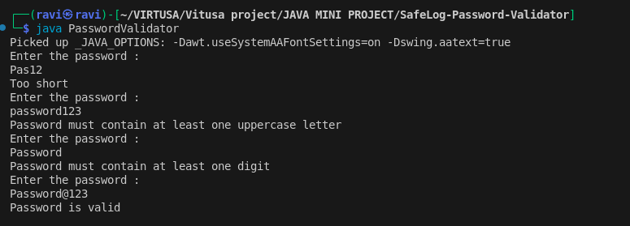

# VIRTUSA SAFELOG PASSWORD VALIDATOR

## Overview

The SafeLog Password Validator is a Core Java application developed to enforce strong password policies for an employee portal. The program validates user input based on predefined security rules and provides specific feedback for invalid passwords.

## Features

* Ensures password length is at least 8 characters
* Checks for at least one uppercase letter
* Checks for at least one digit
* Provides detailed feedback for each validation failure
* Allows repeated attempts until a valid password is entered

## Technologies Used

* Java
* Scanner (for user input)
* String manipulation
* Loop control (for loop and while loop)

## How It Works

1. The user is prompted to enter a password.
2. The system checks:

   * Length of the password
   * Presence of uppercase letters
   * Presence of digits
3. If any condition fails, a specific message is displayed.
4. The user is asked to re-enter the password until it is valid.

## Sample Output

## How to Run

1. Compile the program:
   javac PasswordValidator.java

2. Run the program:
   java PasswordValidator

